# B2B SaaS 平台架构文档

## 1. 系统架构概览

### 1.1 整体架构图

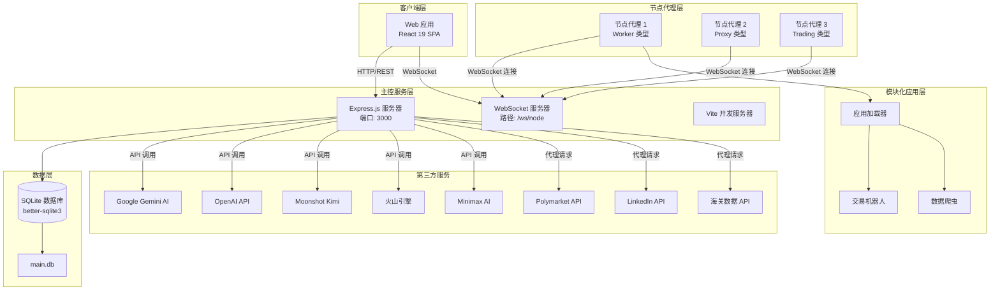

### 1.2 前后端分离架构

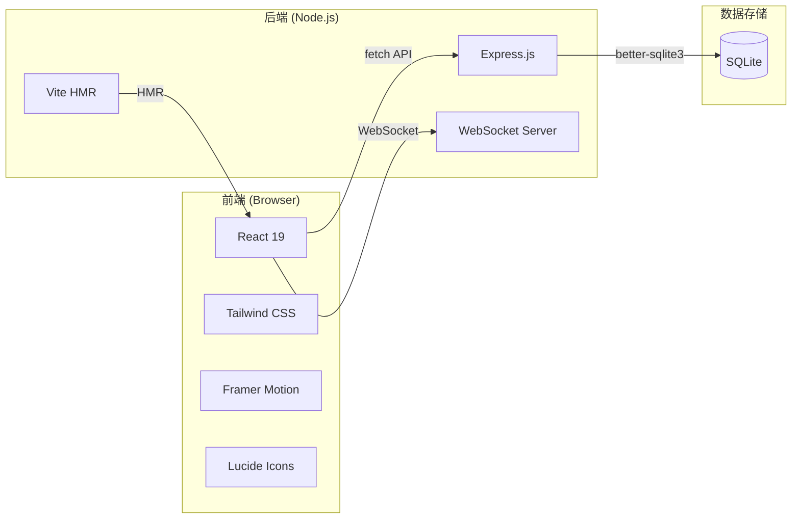

### 1.3 WebSocket 实时通信架构

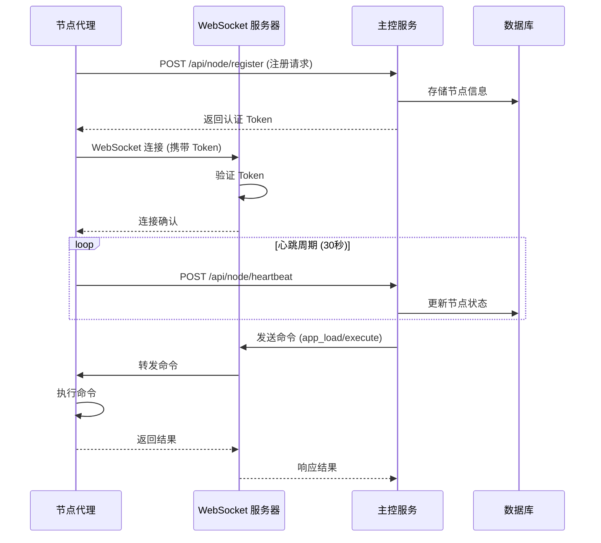

---

## 2. 技术栈

### 2.1 前端技术栈

| 技术 | 版本 | 用途 |
|------|------|------|
| React | 19.0.0 | UI 框架，组件化开发 |
| TypeScript | ~5.8.2 | 类型安全，开发体验增强 |
| Tailwind CSS | 4.1.14 | 原子化 CSS 框架 |
| Vite | 6.2.0 | 构建工具，开发服务器 |
| Framer Motion | 12.34.3 | 动画库，流畅交互 |
| Lucide React | 0.546.0 | 图标库 |
| Recharts | 3.7.0 | 图表可视化 |
| React Markdown | 10.1.0 | Markdown 渲染 |

### 2.2 后端技术栈

| 技术 | 版本 | 用途 |
|------|------|------|
| Express.js | 4.22.1 | Web 服务器框架 |
| TypeScript | ~5.8.2 | 类型安全 |
| SQLite (better-sqlite3) | 12.6.2 | 嵌入式数据库 |
| WebSocket (ws) | 8.14.0 | 实时双向通信 |
| Multer | 2.1.0 | 文件上传处理 |
| Axios | 1.13.6 | HTTP 客户端 |

### 2.3 AI 集成

| 服务 | SDK/方式 | 模型支持 |
|------|----------|----------|
| Google Gemini | @google/genai ^1.43.0 | gemini-2.0-flash |
| OpenAI | openai ^6.25.0 | gpt-4o-mini |
| Kimi (Moonshot) | OpenAI 兼容 API | moonshot-v1-8k |
| Volcengine (火山引擎) | REST API | 自定义模型 |
| Minimax | REST API | abab6.5-chat |

---

## 3. 模块划分

### 3.1 用户管理模块

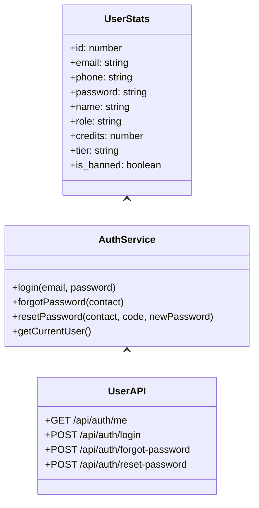

**功能特性：**
- 用户认证与授权
- 角色权限管理 (admin/user)
- 用户等级系统 (Basic/Professional/Enterprise)
- 积分系统
- 账户封禁管理

### 3.2 Polymarket 交易模块

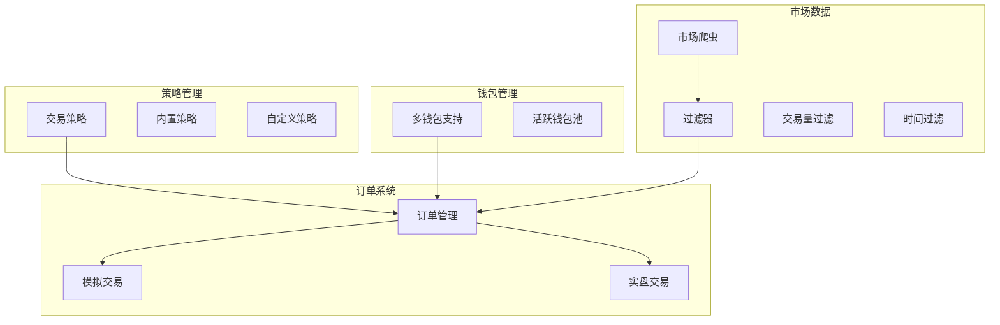

**核心功能：**
- 多钱包管理与轮换
- 交易策略配置 (风险套利、跟单、AI情绪分析)
- 模拟交易与实盘交易
- 市场数据爬取与过滤
- 订单并发控制与滑点管理

### 3.3 爬虫任务模块

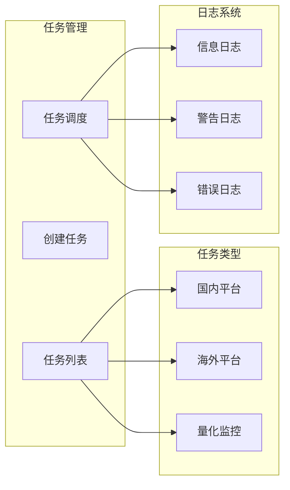

**支持平台：**
- 1688 (国内供应商)
- LinkedIn (海外采购商)
- US CBP (美国海关数据)
- Polymarket (量化监控)

### 3.4 节点管理模块

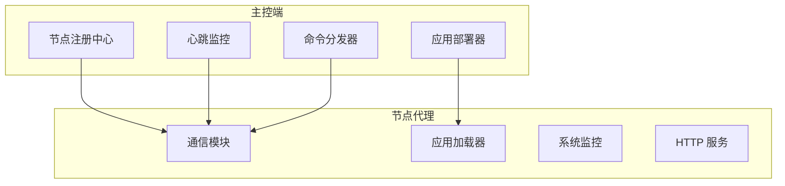

**节点类型：**
- `worker`: 工作节点，执行通用任务
- `proxy`: 代理节点，提供网络代理
- `browser`: 浏览器节点，运行无头浏览器
- `trading`: 交易节点，执行交易策略

### 3.5 模块化应用模块

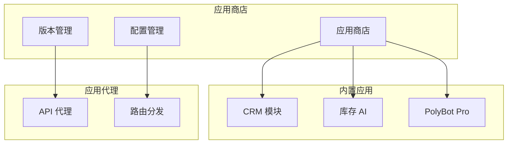

**应用特性：**
- 版本管理与升级
- 公开/私有配置
- API 接口对接
- 热重载支持

### 3.6 计费系统模块

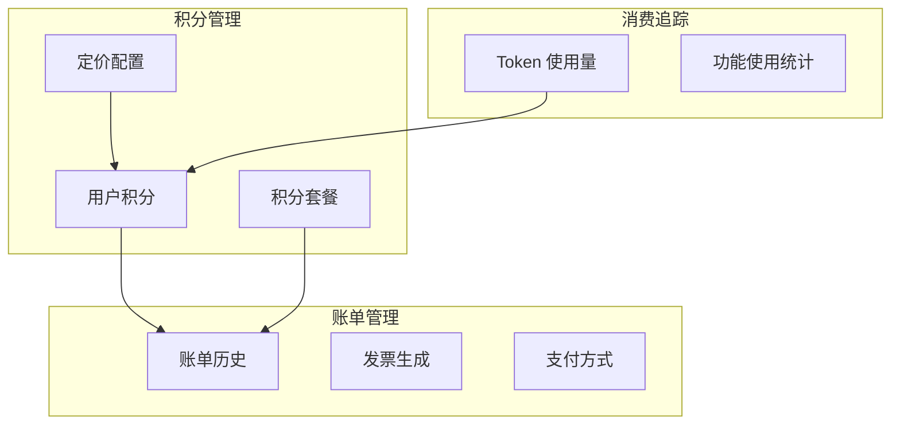

**计费特性：**
- 功能级别定价 (AI博客、市场研究、线索挖掘等)
- 积分包购买
- 账单历史追踪
- Token 使用统计

### 3.7 第三方集成模块

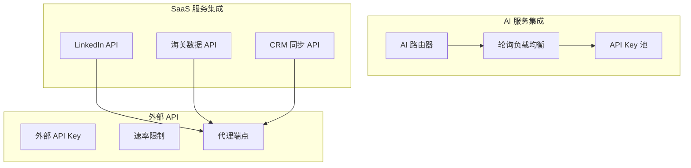

---

## 4. 数据流向

### 4.1 前端 -> API -> 数据库

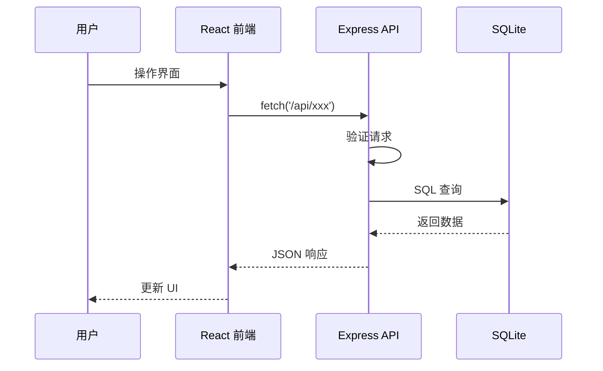

### 4.2 节点代理 -> WebSocket -> 主控端

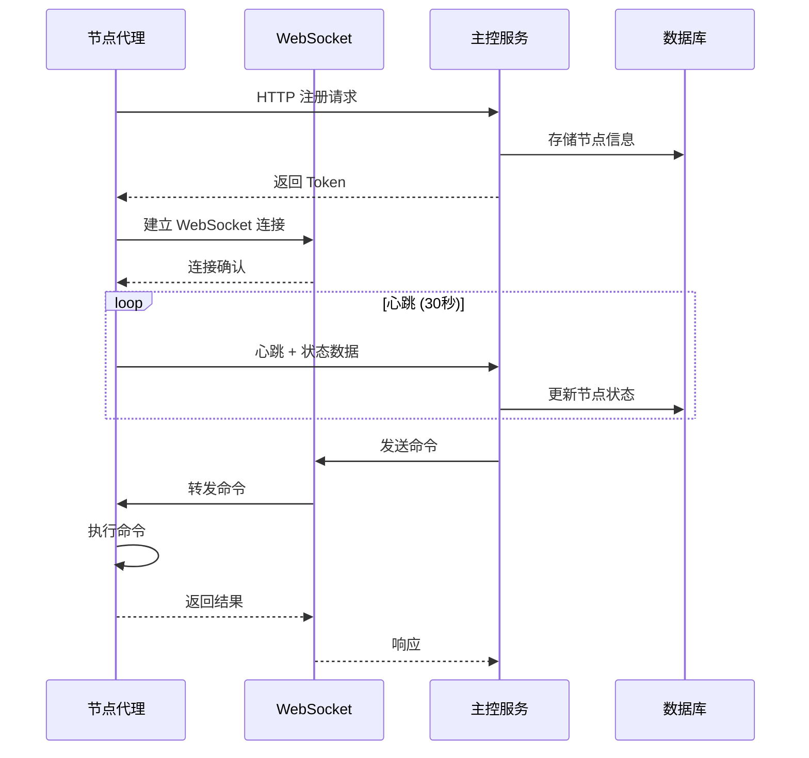

### 4.3 AI 服务调用流程

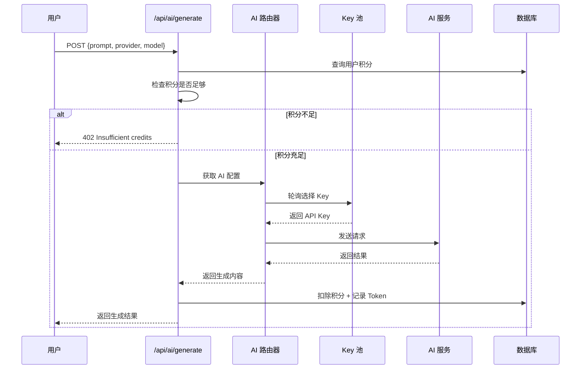

---

## 5. 第三方服务集成

### 5.1 AI 模型服务

| 服务商 | 端点 | 认证方式 | 默认模型 |
|--------|------|----------|----------|
| Google Gemini | Google AI SDK | API Key | gemini-2.0-flash |
| OpenAI | api.openai.com | Bearer Token | gpt-4o-mini |
| Kimi | api.moonshot.cn | OpenAI 兼容 | moonshot-v1-8k |
| Volcengine | ark.cn-beijing.volces.com | Bearer Token | 自定义 |
| Minimax | api.minimax.chat | Bearer Token | abab6.5-chat |

**轮询负载均衡：**
```typescript
const getNextApiKey = (provider: string) => {
  const config = db.prepare(`
    SELECT * FROM model_configs 
    WHERE provider = ? AND is_active = 1 
    ORDER BY last_used_at ASC NULLS FIRST 
    LIMIT 1
  `).get(provider);
  
  if (config) {
    db.prepare("UPDATE model_configs SET last_used_at = CURRENT_TIMESTAMP WHERE id = ?").run(config.id);
    return { key: config.api_key, baseUrl: config.base_url };
  }
  return { key: process.env[`${provider.toUpperCase()}_API_KEY`], baseUrl: null };
};
```

### 5.2 Polymarket API

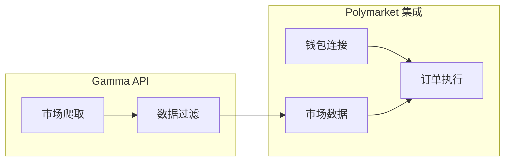

**集成功能：**
- 多钱包管理
- 市场数据爬取 (Gamma API)
- 订单执行 (Paper/Live 模式)
- 策略自动化

### 5.3 LinkedIn API

```typescript
app.post("/api/saas/linkedin/search", async (req, res) => {
  const { query } = req.body;
  const config = db.prepare("SELECT * FROM third_party_saas_configs WHERE type = 'linkedin' AND status = 'active' LIMIT 1").get();
  
  if (!config) return res.status(503).json({ error: "LinkedIn service not configured." });
  
  // 代理请求到 LinkedIn Helper 或类似 SaaS 服务
  const results = await proxyToLinkedIn(config.base_url, config.api_key, query);
  res.json(results);
});
```

### 5.4 海关数据 API

```typescript
app.post("/api/saas/customs/search", async (req, res) => {
  const { hsCode, country } = req.body;
  const config = db.prepare("SELECT * FROM third_party_saas_configs WHERE type = 'customs' AND status = 'active' LIMIT 1").get();
  
  // 对接 ImportGenius 或 Panjiva 等海关数据服务
  const results = await proxyToCustomsAPI(config, hsCode, country);
  res.json(results);
});
```

---

## 6. 数据库设计

### 6.1 核心表结构

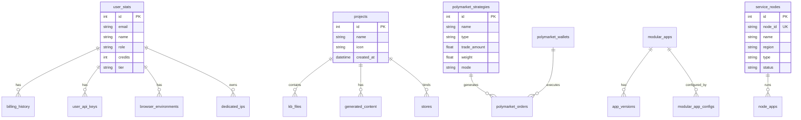

### 6.2 主要数据表

| 表名 | 用途 | 关键字段 |
|------|------|----------|
| user_stats | 用户信息与统计 | id, email, credits, tier, role |
| projects | 项目管理 | id, name, icon |
| polymarket_wallets | Polymarket 钱包 | id, name, private_key, is_active |
| polymarket_strategies | 交易策略 | id, name, type, trade_amount, mode |
| polymarket_orders | 交易订单 | id, strategy_id, market_id, type, mode |
| crawler_tasks | 爬虫任务 | id, name, platform, status, progress |
| modular_apps | 模块化应用 | id, name, app_key, status |
| service_nodes | 服务节点 | node_id, name, region, type, status |
| model_configs | AI 模型配置 | id, provider, api_key, base_url |
| pricing_configs | 定价配置 | feature_key, credit_cost |
| billing_history | 账单历史 | user_id, amount, credits_added |

---

## 7. 安全设计

### 7.1 认证与授权

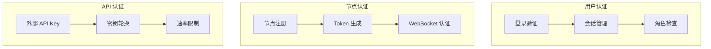

### 7.2 安全措施

- **密码存储**: 简单存储 (演示用，生产环境应使用 bcrypt)
- **API Key 轮换**: 支持外部 API Key 轮换
- **节点 Token**: 基于时间过期的 Token 机制
- **角色权限**: admin/user 角色区分
- **账户封禁**: is_banned 字段控制

---

## 8. 部署架构

### 8.1 开发环境

```bash
# 主服务
npm run dev          # 启动主控服务 (端口 3000)

# 节点代理
cd node-agent
npm run dev          # 启动节点代理 (端口 3100)
```

### 8.2 生产环境

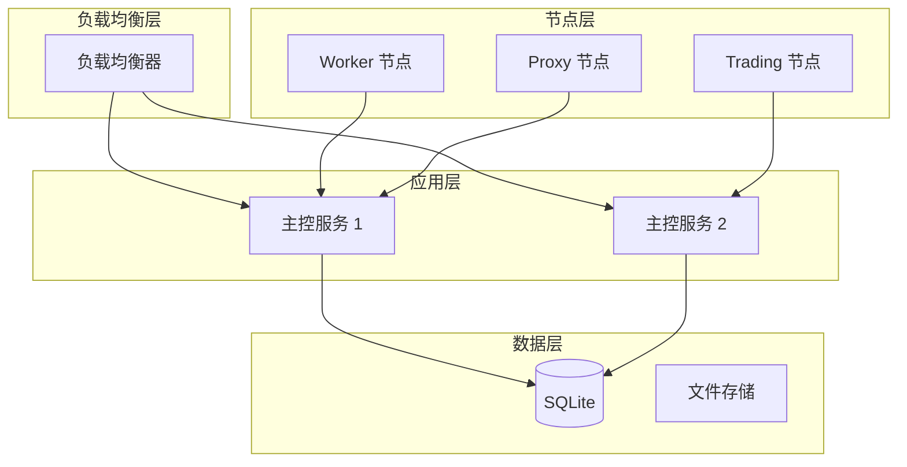

---

## 9. 扩展性设计

### 9.1 模块化应用扩展

```typescript
// 应用清单示例 (manifest.json)
{
  "id": "trading-bot",
  "name": "Trading Bot",
  "version": "1.0.0",
  "entry": "index.js",
  "routes": [
    { "path": "/trade", "method": "POST", "handler": "executeTrade" }
  ],
  "config": {
    "maxConcurrency": 5,
    "slippageTolerance": 1.5
  }
}
```

### 9.2 节点扩展

- 支持动态注册新节点
- 基于区域的路由分发
- 应用热部署与卸载
- 节点健康监控与自动恢复

---

## 10. 监控与日志

### 10.1 系统监控

- CPU/内存/磁盘使用率
- 节点心跳状态
- 应用运行状态
- 请求计数与错误统计

### 10.2 日志系统

```typescript
// 爬虫日志
crawler_logs: {
  task_id: string,
  level: 'info' | 'warning' | 'error',
  source: string,
  message: string,
  details: string
}

// 节点日志 (Winston)
{
  level: 'info',
  message: 'Node registered',
  meta: { nodeId, name, region }
}
```

---

## 11. API 端点汇总

### 11.1 认证 API

| 方法 | 端点 | 描述 |
|------|------|------|
| POST | /api/auth/login | 用户登录 |
| POST | /api/auth/forgot-password | 忘记密码 |
| POST | /api/auth/reset-password | 重置密码 |
| GET | /api/auth/me | 获取当前用户 |

### 11.2 用户管理 API

| 方法 | 端点 | 描述 |
|------|------|------|
| GET | /api/admin/users | 获取用户列表 |
| POST | /api/admin/users | 创建用户 |
| PATCH | /api/admin/users/:id | 更新用户 |

### 11.3 Polymarket API

| 方法 | 端点 | 描述 |
|------|------|------|
| GET | /api/polymarket/wallets | 获取钱包列表 |
| POST | /api/polymarket/wallets | 添加钱包 |
| GET | /api/polymarket/strategies | 获取策略列表 |
| POST | /api/polymarket/orders | 创建订单 |
| GET | /api/polymarket/scrape | 爬取市场数据 |

### 11.4 节点管理 API

| 方法 | 端点 | 描述 |
|------|------|------|
| POST | /api/node/register | 节点注册 |
| POST | /api/node/heartbeat | 节点心跳 |
| GET | /api/admin/nodes | 获取节点列表 |
| POST | /api/admin/nodes/:nodeId/deploy | 部署应用到节点 |

### 11.5 AI 生成 API

| 方法 | 端点 | 描述 |
|------|------|------|
| POST | /api/ai/generate | AI 内容生成 |
| POST | /api/external/generate | 外部 API 代理 |

---

## 12. 项目目录结构

```
b2b-over-sever-framework/
├── src/                          # 前端源码
│   ├── apps/                     # 应用模块
│   │   ├── ai-operations/        # AI 操作
│   │   ├── b2b-leads/            # B2B 线索
│   │   ├── cloud-browser/        # 云浏览器
│   │   ├── customer-service/     # 客户服务
│   │   ├── logistics-tracking/   # 物流追踪
│   │   ├── market-research/      # 市场研究
│   │   ├── polymarket-bot/       # Polymarket 机器人
│   │   ├── site-generator/       # 站点生成器
│   │   └── social-media/         # 社交媒体
│   ├── components/               # 公共组件
│   ├── pages/                    # 页面组件
│   ├── App.tsx                   # 应用入口
│   ├── db.ts                     # 数据库初始化
│   └── main.tsx                  # React 入口
├── node-agent/                   # 节点代理
│   ├── apps/                     # 应用目录
│   │   ├── data-scraper/         # 数据爬虫
│   │   └── trading-bot/          # 交易机器人
│   ├── config/                   # 配置文件
│   └── src/                      # 源码
│       ├── app-loader.ts         # 应用加载器
│       ├── communicator.ts       # 通信模块
│       ├── http-server.ts        # HTTP 服务
│       ├── index.ts              # 入口
│       ├── logger.ts             # 日志模块
│       ├── monitor.ts            # 系统监控
│       └── types.ts              # 类型定义
├── server.ts                     # 主控服务
├── main.db                       # SQLite 数据库
├── package.json                  # 项目配置
├── tsconfig.json                 # TypeScript 配置
└── vite.config.ts                # Vite 配置
```

---

*文档版本: 1.0.0*  
*最后更新: 2026-03-06*
