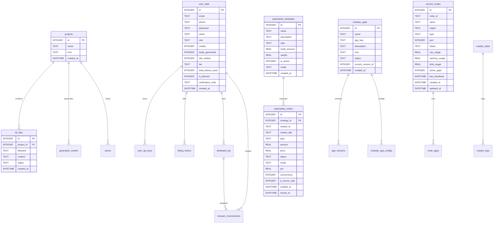

# 数据库设计文档

## 1. 数据库概览

| 属性 | 值 |
|------|-----|
| 数据库类型 | SQLite |
| 驱动 | better-sqlite3 |
| 数据库文件 | `{project_root}/main.db` |
| 字符编码 | UTF-8 |

---

## 2. 表结构说明

### 2.1 核心业务表

#### projects - 项目表

| 字段 | 类型 | 约束 | 说明 |
|------|------|------|------|
| id | INTEGER | PRIMARY KEY AUTOINCREMENT | 项目ID |
| name | TEXT | NOT NULL | 项目名称 |
| icon | TEXT | - | 项目图标 |
| created_at | DATETIME | DEFAULT CURRENT_TIMESTAMP | 创建时间 |

#### kb_files - 知识库文件表

| 字段 | 类型 | 约束 | 说明 |
|------|------|------|------|
| id | INTEGER | PRIMARY KEY AUTOINCREMENT | 文件ID |
| project_id | INTEGER | FOREIGN KEY → projects(id) | 所属项目ID |
| filename | TEXT | NOT NULL | 文件名 |
| content | TEXT | - | 文件内容 |
| status | TEXT | DEFAULT 'parsed' | 状态：parsed, pending, error |
| created_at | DATETIME | DEFAULT CURRENT_TIMESTAMP | 创建时间 |

#### generated_content - 生成内容表

| 字段 | 类型 | 约束 | 说明 |
|------|------|------|------|
| id | INTEGER | PRIMARY KEY AUTOINCREMENT | 内容ID |
| project_id | INTEGER | FOREIGN KEY → projects(id) | 所属项目ID |
| type | TEXT | - | 内容类型：blog, site_config 等 |
| title | TEXT | - | 标题 |
| content | TEXT | - | 内容 |
| created_at | DATETIME | DEFAULT CURRENT_TIMESTAMP | 创建时间 |

#### stores - 商店绑定表

| 字段 | 类型 | 约束 | 说明 |
|------|------|------|------|
| id | INTEGER | PRIMARY KEY AUTOINCREMENT | 商店ID |
| project_id | INTEGER | FOREIGN KEY → projects(id) | 所属项目ID |
| type | TEXT | - | 商店类型：shopify, wordpress, custom 等 |
| auth_method | TEXT | - | 认证方式：oauth, token, credentials |
| store_url | TEXT | - | 商店URL |
| access_token | TEXT | - | 访问令牌 |
| username | TEXT | - | 用户名 |
| password | TEXT | - | 密码 |
| status | TEXT | DEFAULT 'connected' | 状态：connected, disconnected |
| created_at | DATETIME | DEFAULT CURRENT_TIMESTAMP | 创建时间 |

---

### 2.2 用户相关表

#### user_stats - 用户统计表

| 字段 | 类型 | 约束 | 说明 |
|------|------|------|------|
| id | INTEGER | PRIMARY KEY AUTOINCREMENT | 用户ID |
| email | TEXT | UNIQUE | 邮箱地址 |
| phone | TEXT | UNIQUE | 手机号码 |
| password | TEXT | DEFAULT '123456' | 密码 |
| name | TEXT | - | 用户名 |
| role | TEXT | DEFAULT 'user' | 角色：admin, user |
| credits | INTEGER | DEFAULT 1250 | 积分余额 |
| leads_generated | INTEGER | DEFAULT 342 | 生成的线索数 |
| site_visitors | INTEGER | DEFAULT 12400 | 网站访客数 |
| tier | TEXT | DEFAULT 'Professional' | 等级：Basic, Professional, Enterprise |
| total_tokens_used | INTEGER | DEFAULT 0 | 总Token使用量 |
| is_banned | INTEGER | DEFAULT 0 | 是否封禁：0-否, 1-是 |
| verification_code | TEXT | - | 验证码 |
| created_at | DATETIME | DEFAULT CURRENT_TIMESTAMP | 创建时间 |

#### user_api_keys - 用户API密钥表

| 字段 | 类型 | 约束 | 说明 |
|------|------|------|------|
| id | INTEGER | PRIMARY KEY AUTOINCREMENT | 密钥ID |
| user_id | INTEGER | FOREIGN KEY → user_stats(id) | 用户ID |
| provider | TEXT | - | 提供商：openai, gemini, anthropic 等 |
| api_key | TEXT | NOT NULL | API密钥 |
| created_at | DATETIME | DEFAULT CURRENT_TIMESTAMP | 创建时间 |

---

### 2.3 Polymarket 相关表

#### polymarket_wallets - 钱包表

| 字段 | 类型 | 约束 | 说明 |
|------|------|------|------|
| id | INTEGER | PRIMARY KEY AUTOINCREMENT | 钱包ID |
| name | TEXT | - | 钱包名称 |
| private_key | TEXT | NOT NULL | 私钥 |
| api_key | TEXT | - | API密钥 |
| is_active | INTEGER | DEFAULT 1 | 是否激活：0-否, 1-是 |
| created_at | DATETIME | DEFAULT CURRENT_TIMESTAMP | 创建时间 |

#### polymarket_strategies - 策略表

| 字段 | 类型 | 约束 | 说明 |
|------|------|------|------|
| id | INTEGER | PRIMARY KEY AUTOINCREMENT | 策略ID |
| name | TEXT | NOT NULL | 策略名称 |
| description | TEXT | - | 策略描述 |
| type | TEXT | DEFAULT 'custom' | 类型：built-in, custom |
| trade_amount | REAL | DEFAULT 100 | 交易金额 |
| weight | REAL | DEFAULT 1.0 | 权重 |
| is_active | INTEGER | DEFAULT 1 | 是否激活：0-否, 1-是 |
| mode | TEXT | DEFAULT 'paper' | 模式：paper, live |
| created_at | DATETIME | DEFAULT CURRENT_TIMESTAMP | 创建时间 |

#### polymarket_orders - 订单表

| 字段 | 类型 | 约束 | 说明 |
|------|------|------|------|
| id | INTEGER | PRIMARY KEY AUTOINCREMENT | 订单ID |
| strategy_id | INTEGER | FOREIGN KEY → polymarket_strategies(id) | 策略ID |
| market_id | TEXT | - | 市场ID |
| market_title | TEXT | - | 市场标题 |
| type | TEXT | - | 类型：YES, NO |
| amount | REAL | - | 金额 |
| price | REAL | - | 价格 |
| status | TEXT | DEFAULT 'open' | 状态：open, closed, cancelled |
| mode | TEXT | - | 模式：paper, live |
| pnl | REAL | DEFAULT 0 | 盈亏 |
| concurrency | INTEGER | DEFAULT 1 | 并发数 |
| is_server_side | INTEGER | DEFAULT 0 | 是否服务端执行：0-否, 1-是 |
| created_at | DATETIME | DEFAULT CURRENT_TIMESTAMP | 创建时间 |
| closed_at | DATETIME | - | 关闭时间 |

#### polymarket_config - 配置表

| 字段 | 类型 | 约束 | 说明 |
|------|------|------|------|
| id | INTEGER | PRIMARY KEY AUTOINCREMENT | 配置ID |
| key | TEXT | UNIQUE | 配置键 |
| value | TEXT | - | 配置值 |
| updated_at | DATETIME | DEFAULT CURRENT_TIMESTAMP | 更新时间 |

---

### 2.4 爬虫相关表

#### crawler_tasks - 爬虫任务表

| 字段 | 类型 | 约束 | 说明 |
|------|------|------|------|
| id | TEXT | PRIMARY KEY | 任务ID |
| name | TEXT | NOT NULL | 任务名称 |
| platform | TEXT | - | 平台：1688, LinkedIn, US CBP 等 |
| status | TEXT | DEFAULT 'paused' | 状态：running, paused, completed |
| progress | INTEGER | DEFAULT 0 | 进度 |
| total | INTEGER | DEFAULT 0 | 总数 |
| creator | TEXT | - | 创建者 |
| priority | TEXT | DEFAULT 'Medium' | 优先级：Low, Medium, High |
| type | TEXT | - | 类型：domestic, overseas |
| crawler_mode | TEXT | DEFAULT 'standard' | 模式：standard, quant |
| last_run | DATETIME | - | 最后运行时间 |
| created_at | DATETIME | DEFAULT CURRENT_TIMESTAMP | 创建时间 |

#### crawler_logs - 爬虫日志表

| 字段 | 类型 | 约束 | 说明 |
|------|------|------|------|
| id | INTEGER | PRIMARY KEY AUTOINCREMENT | 日志ID |
| task_id | TEXT | - | 任务ID |
| level | TEXT | DEFAULT 'info' | 级别：info, warning, error |
| source | TEXT | - | 来源：google_search, linkedin, custom_scraper |
| message | TEXT | NOT NULL | 消息 |
| details | TEXT | - | 详情 |
| created_at | DATETIME | DEFAULT CURRENT_TIMESTAMP | 创建时间 |

---

### 2.5 节点管理表

#### service_nodes - 服务节点表

| 字段 | 类型 | 约束 | 说明 |
|------|------|------|------|
| id | INTEGER | PRIMARY KEY AUTOINCREMENT | 节点ID |
| node_id | TEXT | UNIQUE NOT NULL | 节点标识 |
| name | TEXT | NOT NULL | 节点名称 |
| region | TEXT | DEFAULT 'default' | 区域：us-east, eu-west, asia |
| type | TEXT | DEFAULT 'worker' | 类型：worker, proxy, trading |
| port | INTEGER | DEFAULT 3100 | 端口 |
| status | TEXT | DEFAULT 'offline' | 状态：online, offline |
| cpu_usage | REAL | DEFAULT 0 | CPU使用率 |
| memory_usage | REAL | DEFAULT 0 | 内存使用率 |
| disk_usage | REAL | DEFAULT 0 | 磁盘使用率 |
| active_apps | INTEGER | DEFAULT 0 | 活跃应用数 |
| last_heartbeat | DATETIME | - | 最后心跳时间 |
| created_at | DATETIME | DEFAULT CURRENT_TIMESTAMP | 创建时间 |
| updated_at | DATETIME | DEFAULT CURRENT_TIMESTAMP | 更新时间 |

#### node_apps - 节点应用表

| 字段 | 类型 | 约束 | 说明 |
|------|------|------|------|
| id | INTEGER | PRIMARY KEY AUTOINCREMENT | 记录ID |
| node_id | TEXT | NOT NULL, FOREIGN KEY → service_nodes(node_id) | 节点ID |
| app_id | TEXT | NOT NULL | 应用ID |
| app_name | TEXT | - | 应用名称 |
| version | TEXT | - | 版本 |
| status | TEXT | DEFAULT 'stopped' | 状态：running, stopped, error |
| memory_usage | REAL | DEFAULT 0 | 内存使用量 |
| request_count | INTEGER | DEFAULT 0 | 请求数 |
| error_count | INTEGER | DEFAULT 0 | 错误数 |
| created_at | DATETIME | DEFAULT CURRENT_TIMESTAMP | 创建时间 |
| updated_at | DATETIME | DEFAULT CURRENT_TIMESTAMP | 更新时间 |

**唯一约束**: (node_id, app_id)

---

### 2.6 模块化应用表

#### modular_apps - 模块化应用表

| 字段 | 类型 | 约束 | 说明 |
|------|------|------|------|
| id | INTEGER | PRIMARY KEY AUTOINCREMENT | 应用ID |
| name | TEXT | NOT NULL | 应用名称 |
| app_key | TEXT | UNIQUE NOT NULL | 应用标识 |
| description | TEXT | - | 描述 |
| icon | TEXT | - | 图标 |
| status | TEXT | DEFAULT 'active' | 状态：active, inactive, upgrading |
| current_version_id | INTEGER | - | 当前版本ID |
| created_at | DATETIME | DEFAULT CURRENT_TIMESTAMP | 创建时间 |

#### app_versions - 应用版本表

| 字段 | 类型 | 约束 | 说明 |
|------|------|------|------|
| id | INTEGER | PRIMARY KEY AUTOINCREMENT | 版本ID |
| app_id | INTEGER | FOREIGN KEY → modular_apps(id) | 应用ID |
| version_number | TEXT | NOT NULL | 版本号 |
| endpoint_url | TEXT | NOT NULL | 端点URL |
| changelog | TEXT | - | 更新日志 |
| is_stable | INTEGER | DEFAULT 1 | 是否稳定版：0-否, 1-是 |
| created_at | DATETIME | DEFAULT CURRENT_TIMESTAMP | 创建时间 |

#### modular_app_configs - 应用配置表

| 字段 | 类型 | 约束 | 说明 |
|------|------|------|------|
| id | INTEGER | PRIMARY KEY AUTOINCREMENT | 配置ID |
| app_id | INTEGER | FOREIGN KEY → modular_apps(id) | 应用ID |
| config_key | TEXT | NOT NULL | 配置键 |
| config_value | TEXT | - | 配置值 |
| description | TEXT | - | 描述 |
| is_public | INTEGER | DEFAULT 0 | 是否公开：0-隐藏, 1-可见 |
| created_at | DATETIME | DEFAULT CURRENT_TIMESTAMP | 创建时间 |

**唯一约束**: (app_id, config_key)

---

### 2.7 计费相关表

#### pricing_configs - 定价配置表

| 字段 | 类型 | 约束 | 说明 |
|------|------|------|------|
| id | INTEGER | PRIMARY KEY AUTOINCREMENT | 配置ID |
| feature_key | TEXT | UNIQUE | 功能标识：ai_blog, market_research 等 |
| feature_name | TEXT | - | 功能名称 |
| credit_cost | INTEGER | DEFAULT 5 | 积分消耗 |
| updated_at | DATETIME | DEFAULT CURRENT_TIMESTAMP | 更新时间 |

#### credit_packages - 积分套餐表

| 字段 | 类型 | 约束 | 说明 |
|------|------|------|------|
| id | INTEGER | PRIMARY KEY AUTOINCREMENT | 套餐ID |
| name | TEXT | NOT NULL | 套餐名称 |
| credits | INTEGER | NOT NULL | 积分数量 |
| price | REAL | NOT NULL | 价格(USD) |
| is_active | INTEGER | DEFAULT 1 | 是否激活：0-否, 1-是 |
| created_at | DATETIME | DEFAULT CURRENT_TIMESTAMP | 创建时间 |

#### billing_history - 账单历史表

| 字段 | 类型 | 约束 | 说明 |
|------|------|------|------|
| id | INTEGER | PRIMARY KEY AUTOINCREMENT | 账单ID |
| user_id | INTEGER | FOREIGN KEY → user_stats(id) | 用户ID |
| amount | REAL | - | 金额(USD) |
| credits_added | INTEGER | - | 添加的积分 |
| payment_method | TEXT | - | 支付方式 |
| status | TEXT | DEFAULT 'completed' | 状态：pending, completed, failed |
| invoice_no | TEXT | - | 发票号 |
| created_at | DATETIME | DEFAULT CURRENT_TIMESTAMP | 创建时间 |

---

### 2.8 资源配置表

#### dedicated_ips - 专用IP表

| 字段 | 类型 | 约束 | 说明 |
|------|------|------|------|
| id | INTEGER | PRIMARY KEY AUTOINCREMENT | IP ID |
| ip_address | TEXT | UNIQUE NOT NULL | IP地址 |
| server_id | TEXT | - | 服务器ID |
| user_id | INTEGER | FOREIGN KEY → user_stats(id) | 用户ID |
| status | TEXT | DEFAULT 'available' | 状态：available, assigned, expired |
| created_at | DATETIME | DEFAULT CURRENT_TIMESTAMP | 创建时间 |
| expires_at | DATETIME | - | 过期时间 |

#### browser_environments - 浏览器环境表

| 字段 | 类型 | 约束 | 说明 |
|------|------|------|------|
| id | TEXT | PRIMARY KEY | 环境ID |
| user_id | INTEGER | FOREIGN KEY → user_stats(id) | 用户ID |
| server_id | TEXT | - | 服务器ID |
| ip_id | INTEGER | FOREIGN KEY → dedicated_ips(id) | IP ID |
| fingerprint_data | TEXT | - | 指纹数据(JSON) |
| status | TEXT | DEFAULT 'active' | 状态：active, inactive |
| created_at | DATETIME | DEFAULT CURRENT_TIMESTAMP | 创建时间 |

---

### 2.9 系统配置表

#### model_configs - 模型配置表

| 字段 | 类型 | 约束 | 说明 |
|------|------|------|------|
| id | INTEGER | PRIMARY KEY AUTOINCREMENT | 配置ID |
| provider | TEXT | NOT NULL | 提供商：gemini, openai, kimi 等 |
| api_key | TEXT | NOT NULL | API密钥 |
| base_url | TEXT | - | 基础URL |
| is_active | INTEGER | DEFAULT 1 | 是否激活：0-否, 1-是 |
| last_used_at | DATETIME | - | 最后使用时间 |
| created_at | DATETIME | DEFAULT CURRENT_TIMESTAMP | 创建时间 |

#### external_api_keys - 外部API密钥表

| 字段 | 类型 | 约束 | 说明 |
|------|------|------|------|
| id | INTEGER | PRIMARY KEY AUTOINCREMENT | 密钥ID |
| key_value | TEXT | UNIQUE NOT NULL | 密钥值 |
| name | TEXT | - | 名称 |
| status | TEXT | DEFAULT 'active' | 状态：active, inactive |
| created_at | DATETIME | DEFAULT CURRENT_TIMESTAMP | 创建时间 |

#### third_party_saas_configs - 第三方SaaS配置表

| 字段 | 类型 | 约束 | 说明 |
|------|------|------|------|
| id | INTEGER | PRIMARY KEY AUTOINCREMENT | 配置ID |
| name | TEXT | NOT NULL | 名称 |
| type | TEXT | NOT NULL | 类型：linkedin, customs, crm, email_automation |
| api_key | TEXT | - | API密钥 |
| api_secret | TEXT | - | API密钥密文 |
| base_url | TEXT | - | 基础URL |
| status | TEXT | DEFAULT 'active' | 状态：active, inactive |
| created_at | DATETIME | DEFAULT CURRENT_TIMESTAMP | 创建时间 |

---

## 3. 表关系图



---

## 4. 索引说明

### 4.1 主键索引

所有表均使用 `INTEGER PRIMARY KEY AUTOINCREMENT` 或 `TEXT PRIMARY KEY` 作为主键索引。

### 4.2 唯一约束索引

| 表名 | 字段 | 说明 |
|------|------|------|
| user_stats | email | 邮箱唯一 |
| user_stats | phone | 手机号唯一 |
| external_api_keys | key_value | 密钥值唯一 |
| pricing_configs | feature_key | 功能标识唯一 |
| dedicated_ips | ip_address | IP地址唯一 |
| polymarket_config | key | 配置键唯一 |
| modular_apps | app_key | 应用标识唯一 |
| service_nodes | node_id | 节点标识唯一 |

### 4.3 建议添加的索引

```sql
-- 爬虫任务查询优化
CREATE INDEX idx_crawler_logs_task_id ON crawler_logs(task_id);
CREATE INDEX idx_crawler_logs_level ON crawler_logs(level);
CREATE INDEX idx_crawler_logs_created_at ON crawler_logs(created_at);

-- 订单查询优化
CREATE INDEX idx_polymarket_orders_strategy_id ON polymarket_orders(strategy_id);
CREATE INDEX idx_polymarket_orders_status ON polymarket_orders(status);
CREATE INDEX idx_polymarket_orders_mode ON polymarket_orders(mode);

-- 用户相关查询优化
CREATE INDEX idx_user_api_keys_user_id ON user_api_keys(user_id);
CREATE INDEX idx_billing_history_user_id ON billing_history(user_id);

-- 节点应用查询优化
CREATE INDEX idx_node_apps_node_id ON node_apps(node_id);
CREATE INDEX idx_node_apps_status ON node_apps(status);

-- 知识库文件查询优化
CREATE INDEX idx_kb_files_project_id ON kb_files(project_id);
CREATE INDEX idx_kb_files_status ON kb_files(status);

-- 商店查询优化
CREATE INDEX idx_stores_project_id ON stores(project_id);
CREATE INDEX idx_stores_status ON stores(status);

-- 专用IP查询优化
CREATE INDEX idx_dedicated_ips_user_id ON dedicated_ips(user_id);
CREATE INDEX idx_dedicated_ips_status ON dedicated_ips(status);

-- 浏览器环境查询优化
CREATE INDEX idx_browser_environments_user_id ON browser_environments(user_id);
CREATE INDEX idx_browser_environments_ip_id ON browser_environments(ip_id);
```

---

## 5. 数据迁移指南

### 5.1 备份数据

```bash
# 备份整个数据库文件
cp main.db main.db.backup

# 或使用 SQLite 导出
sqlite3 main.db .dump > backup.sql
```

### 5.2 迁移步骤

1. **停止应用服务**
   ```bash
   # 停止所有访问数据库的服务
   pm2 stop all
   ```

2. **备份现有数据**
   ```bash
   sqlite3 main.db .dump > migration_backup_$(date +%Y%m%d).sql
   ```

3. **执行迁移脚本**
   ```bash
   # 方式一：直接执行 SQL 文件
   sqlite3 main.db < migration.sql
   
   # 方式二：通过应用启动自动迁移
   # db.ts 中的 CREATE TABLE IF NOT EXISTS 会自动创建新表
   npm run start
   ```

4. **验证迁移结果**
   ```bash
   # 检查表结构
   sqlite3 main.db ".schema"
   
   # 检查数据完整性
   sqlite3 main.db "PRAGMA integrity_check;"
   ```

5. **重启服务**
   ```bash
   pm2 start all
   ```

### 5.3 回滚方案

1. **使用备份文件恢复**
   ```bash
   # 停止服务
   pm2 stop all
   
   # 恢复备份
   cp main.db.backup main.db
   
   # 重启服务
   pm2 start all
   ```

2. **使用 SQL 备份恢复**
   ```bash
   # 删除当前数据库
   rm main.db
   
   # 从 SQL 备份恢复
   sqlite3 main.db < migration_backup_YYYYMMDD.sql
   ```

### 5.4 迁移注意事项

- SQLite 不支持直接删除列，如需删除列需要重建表
- 外键约束在 SQLite 中默认不强制执行，需启用 `PRAGMA foreign_keys = ON`
- 大数据量迁移时建议分批处理，避免锁表时间过长
- 迁移前务必测试迁移脚本在测试环境中的执行效果

---

## 6. 默认数据

系统初始化时会插入以下默认数据：

### 用户数据
| ID | 邮箱 | 角色 | 等级 |
|----|------|------|------|
| 1 | admin | admin | Enterprise |
| 2 | std | user | Professional |
| 3 | fenix19830717a@gmail.com | admin | Professional |

### 积分套餐
| 名称 | 积分 | 价格(USD) |
|------|------|-----------|
| Starter Pack | 1,000 | $19.99 |
| Pro Pack | 5,000 | $79.99 |
| Enterprise Pack | 20,000 | $249.99 |

### 定价配置
| 功能 | 积分消耗 |
|------|----------|
| AI Blog Writing | 5 |
| Market Research | 10 |
| B2B Lead Mining | 2 |
| Site Generation | 50 |
| AI Video Remix | 20 |

### 模块化应用
| 应用 | 描述 |
|------|------|
| CRM Module | 客户关系管理和线索跟踪 |
| Inventory AI | AI驱动的库存预测和管理 |
| PolyBot Pro | Polymarket预测市场高级交易机器人 |

---

*文档生成时间: 2026-03-06*
*数据库版本: 1.0*
